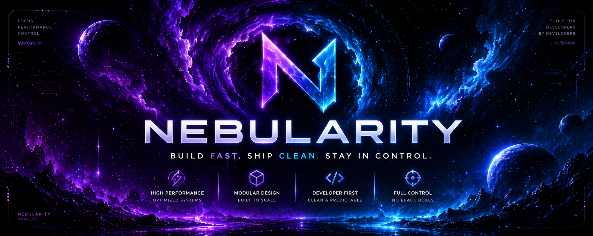

<!-- Banner -->

<p align="center">
  
</p>

<h1 align="center">Nebularity</h1>

<p align="center">
  <strong>Build fast. Ship clean. Stay in control.</strong>
</p>

<p align="center">
  High-performance systems and UI tooling for developers who don’t waste time.
</p>

<p align="center">
  
  
  
</p>

---

## ⚡ What is Nebularity?

Nebularity is a collection of tools built around one principle:

> **Speed without sacrificing control.**

No unnecessary abstractions.
No overengineered systems.
Just tools that integrate fast and behave predictably.

---

## 🧠 Philosophy

```text
Fast > Fancy
Control > Magic
Clean > Clever
Real > Theoretical
```

* Systems should be **understandable at a glance**
* APIs should be **predictable, not surprising**
* Setup should take **minutes, not hours**

---

## 🚀 Core Focus

* Modular UI systems
* Clean state handling
* Minimal overhead architecture
* Fast iteration workflows

---

## 🧩 Projects

### Nebularity UI

A flexible UI library designed for real usage.

```lua
local ui = NebularityUI:CreateUI({
    Theme = "Nebula",
    Title = "Nebularity",
})
```

**Features**

* Tab + Section system
* Toggle, Slider, Dropdown, Keybind, etc.
* Flag-based state binding
* JSON config & preset system
* Live theme switching
* Built-in notifications

> Designed to be used instantly — not configured forever.

---

## 🎨 Design Language

Nebularity follows a strict visual identity:

* Dark interfaces
* Neon accents (purple / cyan)
* Strong contrast
* Minimal noise

Everything exists for a reason.

---

## 📊 Why Nebularity?

Most tools fall into two categories:

| Type        | Problem                     |
| ----------- | --------------------------- |
| Too simple  | Not useful in real projects |
| Too complex | Slows everything down       |

Nebularity solves both:

> **Powerful — but predictable.**

---

## 🧱 Structure

```text
Nebularity
├── UI Systems
├── Core Utilities
├── Preset / Config Handling
└── Future Modules
```

---

## 🔥 Status

* Actively developed
* Used in real projects
* Continuously refined

---

## 🧭 Direction

Nebularity is not a one-off project.

It’s a growing system focused on:

* Better developer experience
* Faster workflows
* Cleaner codebases

---

## 🧠 Philosophy in one line

> Build tools you actually want to use.

---

<p align="center">
  <sub>Made for people shipping real code.</sub>
</p>
